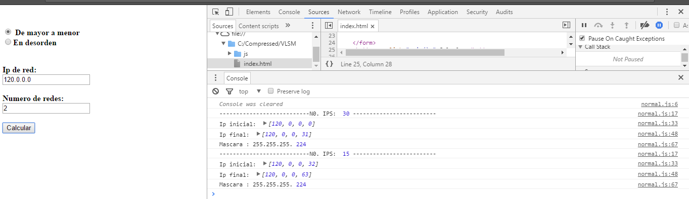

# vlsm
Subneteo vlsm en orden y desorden desde el navegador.

### Calcula
* Inserta comandos de cisco
* Resultados de ip de mayor a menor
* Resultados con ip en desorden (Solo muestra el incremento), pronto automático.

#### Probarlo

[https://juvenal-yescas.github.io/VLSM/](https://juve-yescas.github.io/VLSM/)

=======

### Captura

